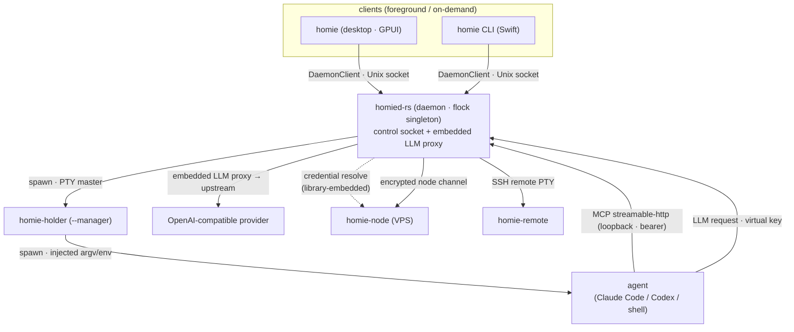
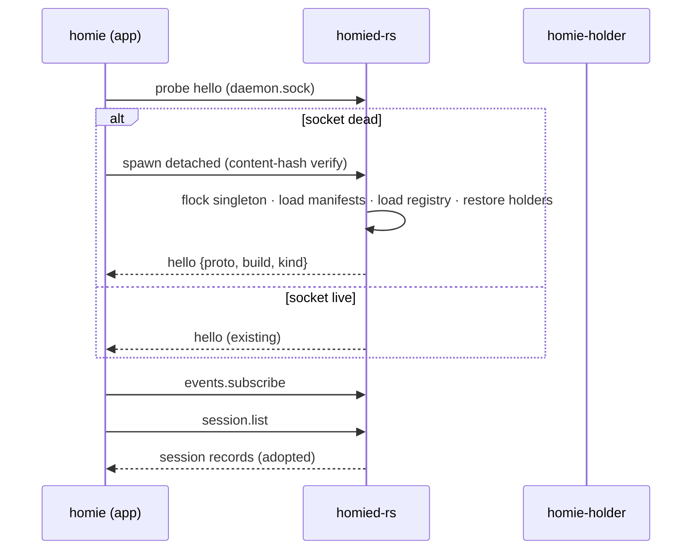
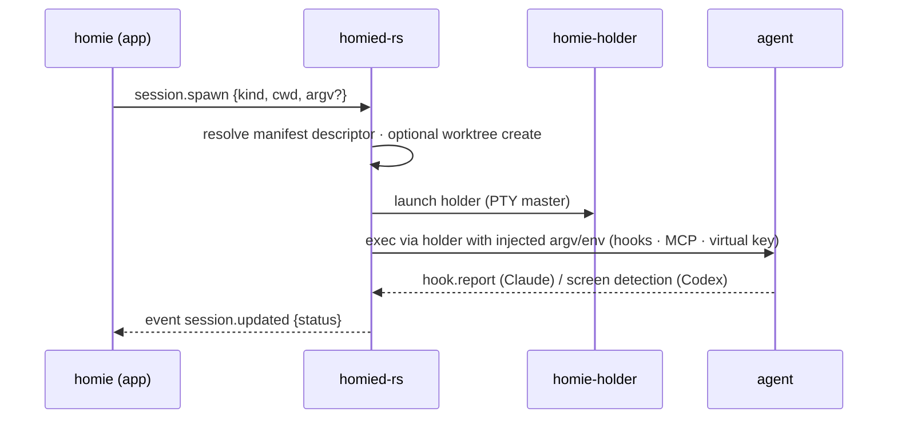
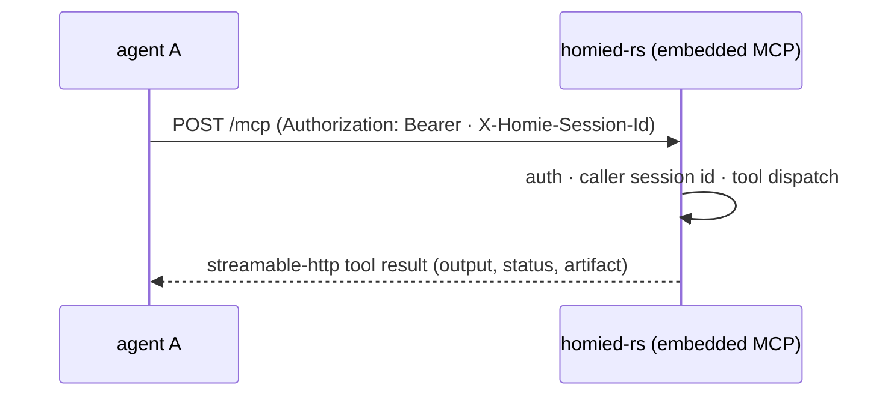
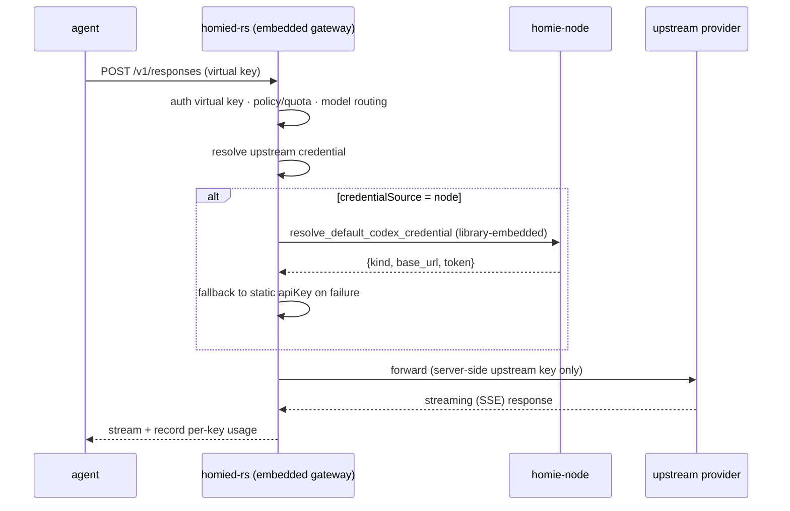
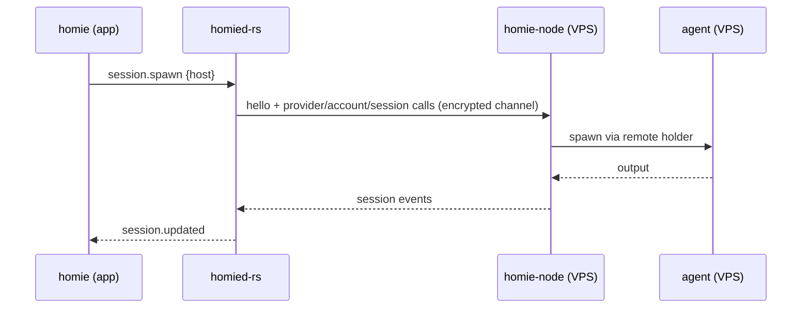

# homie

[](https://github.com/cristicretu/homie/actions/workflows/ci.yml)
[](LICENSE)
[](https://github.com/cristicretu/homie/releases/latest)

Native macOS orchestrator for coding agents. Run Claude Code, Codex, Cursor, Gemini and plain
shells in parallel — across git worktrees or on remote hosts — each with a live status
(working / needs-you / done) and tmux-like persistence: closing the app never kills a session,
and a daemon restart brings conversations back.

- **Many agents at once.** Each session is a real terminal with a real PTY. Group them by
  project, split them across git worktrees, or run them on a remote host over ssh+tmux.
- **Status you can trust.** homie reads what an agent actually painted on its screen and tells
  you which ones are working, which are waiting on you, and which are done — so you can watch
  ten sessions without reading ten terminals.
- **Sessions outlive the app.** A background daemon owns the PTYs. Quit homie, reopen it, and
  everything is still there.
- **Agents can orchestrate agents.** An MCP server lets a running agent spawn another one,
  watch it, read its output, and answer its prompts.
- **One credential entrypoint for OpenAI-compatible agents.** Homie owns the LLM configuration
  for Codex and other OpenAI-compatible agents. Real provider credentials live in Homie; managed
  agents receive virtual keys and call Homie's daemon-embedded OpenAI-compatible proxy, which
  applies policy, records usage, and forwards upstream. Claude Code keeps its native Anthropic
  credentials (Homie still manages its hooks + MCP orchestration, not its LLM traffic).

First-class status detection and resume are Claude Code and Codex. Cursor and Gemini run with
partial support, and anything else runs as a terminal with running/exited status.

---

## Architecture

Homie is a **multi-process, single-daemon** system. One authoritative Rust Engine owns all PTYs,
child agents, and persisted state; everything else is a client or a narrow-purpose helper.



### Process model

| Process | Crate / source | Role | Lifetime |
|---------|----------------|------|----------|
| `homie` (app) | `homie-app` | GPUI desktop: window, sidebar, terminal renderer, palette, usage | foreground |
| `homie` (CLI) | Swift `homie-cli` | `status` / `doctor` / hooks / notify forwarder | on demand |
| `homied-rs` | `homie-engine` | **authoritative daemon/runtime** — PTY orchestration, session registry & persistence, control socket, **embedded LLM gateway** | background, `flock` singleton |
| `homie-holder` | `homie-engine` | owns the PTY master so sessions survive an Engine restart; `--manager` hosts all holders of one registry | daemon lifetime (idle 30s) |
| `homie-node` | `homie-node` | remote execution node (VPS): accounts, provider login, credential custody | remote systemd user service |
| `homie-remote` | `homie-remote` | remote PTY helper (SSH bootstrap / compatibility path) | on demand, remote |
| `homie-ssh-askpass` | `homie-engine` | macOS OpenSSH askpass broker | on demand |

Key invariants:

- **The daemon is the authority.** All background supervision, session orchestration, remote
  spawning, and registry persistence live in `homied-rs`. The app is a client that reconnects
  (500 ms → 8 s backoff) and never blocks UI on daemon startup.
- **The holder is the PTY-survival boundary.** `homie-holder` holds the PTY master; a daemon
  restart adopts the still-running holders instead of killing sessions.
- **Agent support is data, not code.** Each agent is one JSON manifest under
  `homie/crates/homie-engine/manifests/`; spawn flags, resume keys, prompt approval, and screen
  status rules are all declared there.
- **Credentials stay where the agent runs.** Homie never copies raw provider tokens into
  managed-agent config; it issues virtual keys and forwards through the daemon-embedded LLM proxy.

---

## Module map

### Rust crates (`homie/`)

| Crate | Responsibility |
|-------|----------------|
| `homie-app` | GPUI desktop app: window shell, sidebar, terminal, inspector, settings, usage UI |
| `homie-ui` | shared GPUI visual tokens and reusable components |
| `homie-engine` | daemon/runtime: session supervision, control protocol, holders, injection, remote spawn, **embedded LLM proxy** |
| `homie-client` | client API for the app/CLI to talk to the daemon (`DaemonClient`) and nodes (`NodeClient`) |
| `homie-proto` | wire DTOs, control methods/events, paths, remote-PTY protocol |
| `homie-term` | GPUI terminal rendering support |
| `homie-terminal-state` | terminal state model shared by local/remote runtimes |
| `homie-pty` | PTY abstraction |
| `homie-node` | remote node service: accounts, provider login, credential custody (`credentials`) |
| `homie-remote` | remote PTY helper binary |
| `homie-updater` | update/install support |
| `homie-usage` | usage domain types and token estimation |
| `homie-gateway` | LLM gateway **library** (virtual keys, OpenAI-compatible proxy, upstream forwarding, per-key usage); embedded in the daemon, no standalone binary |

Dependency direction (simplified):

```
homie-app ─▶ homie-ui, homie-client, homie-proto, homie-term, homie-updater, homie-usage
homie-client ─▶ homie-proto
homie-engine ─▶ homie-proto, homie-pty, homie-terminal-state, homie-gateway (embedded LLM proxy)
homie-node ─▶ homie-client, homie-proto
homie-gateway ─▶ homie-usage, homie-node (credentials)
homie-remote ─▶ homie-engine, homie-proto, homie-pty, homie-terminal-state
```

### Swift package

| Target | Responsibility |
|--------|----------------|
| `homie-cli` | CLI entrypoint and user-facing commands |
| `HomieProtocol` | Swift protocol DTOs used by CLI surfaces |
| `HomieCore` | core types and packaged/generated resources (agent manifests) |
| `HomieMCP` | Swift MCP support |

---

## Message flow

The control channel is a newline-delimited JSON protocol over an owner-only Unix socket.
Requests carry `{id, method, params}`, responses `{id, ok|err}`, and pushes `{event, seq, params}`.
The `hello` handshake pins the wire version and engine identity.

### 1. Startup



### 2. Session spawn (local)



### 3. Detach, quit, and resume

```mermaid
sequenceDiagram
    participant App as homie (app)
    participant D as homied-rs
    participant H as homie-holder
    participant A as agent

    App->>D: quit (app exits)
    Note over D,H: holder keeps PTY master alive; agent keeps running
    App->>D: relaunch → hello → session.list
    D->>H: adopt live holder
    D->>A: replay offset-addressed output log
    D-->>App: session.updated {scrollback, screen}
```

### 4. Agent-to-agent orchestration (MCP)



### 5. LLM gateway (embedded in daemon)



### 6. Remote node (VPS)



---

## Install

```sh
brew install --cask cristicretu/homie/homie
```

Or download the latest DMG from [Releases](https://github.com/cristicretu/homie/releases/latest),
open it, and drag homie to Applications. Either way it is the same universal build (Apple
silicon and Intel), signed and notarized. homie updates itself from there.

The tap has to be named in full — a bare `homie` resolves only against Homebrew's default
taps. The cask lives in [cristicretu/homebrew-homie](https://github.com/cristicretu/homebrew-homie)
rather than `homebrew-cask`, which requires a notability threshold homie does not meet yet.

macOS 15 or newer.

## 60-second tour

1. Add a project directory and create a session for Claude Code, Codex, another
   supported agent, or a plain shell.
2. Start several sessions, ideally in separate git worktrees when they edit the
   same repository.
3. Watch the sidebar instead of every terminal: it shows which agents are
   working, waiting for you, or done.
4. Quit and reopen homie. The daemon keeps each PTY alive and replays the session
   when you return.

The [getting-started guide](docs/GETTING_STARTED.md) covers remote hosts, MCP
orchestration, diagnostics, local data, and uninstalling.

## Adding an agent

Agent support is data, not code. Each agent is one JSON file in
`homie/crates/homie-engine/manifests/` describing how to spawn it, how to resume,
which keys approve or deny a prompt, and the screen rules that decide whether it
is working, waiting, or done. Copy the closest existing manifest and adjust it,
then run `scripts/sync-agent-manifests.sh` so the Swift CLI/Core resource mirror
stays aligned — no Swift or Rust required. This is the easiest way to
contribute.

## Building from source

Needs both toolchains: Rust (pinned in `homie/rust-toolchain.toml`) and Swift 6 with the Xcode
command-line tools. The first Rust build compiles GPUI from a pinned Zed revision and takes a
while.

```sh
swift build                                # Swift CLI/protocol support
(cd homie && cargo build)                  # Rust app + Engine
(cd homie && cargo run -p homie-app)       # run the app from source

homie/scripts/package.sh                    # full bundle
homie/scripts/install-local.sh
```

Run the same core checks as CI with one command:

```sh
./scripts/check.sh
```

[`homie/PACKAGING.md`](homie/PACKAGING.md) covers signing and notarization,
[`homie/UPDATING.md`](homie/UPDATING.md) the updater and release flow,
[`homie/NODE.md`](homie/NODE.md) running agents on a remote VPS node.

The [documentation index](docs/README.md) links user and engineering guides.

## Contributing

See [CONTRIBUTING.md](CONTRIBUTING.md). Bug reports, fixes, docs, and new agent
manifests are all welcome. New contributors can start with
[`good first issue`](https://github.com/cristicretu/homie/labels/good%20first%20issue)
or [`help wanted`](https://github.com/cristicretu/homie/labels/help%20wanted).

Questions belong in [Discussions](https://github.com/cristicretu/homie/discussions).
